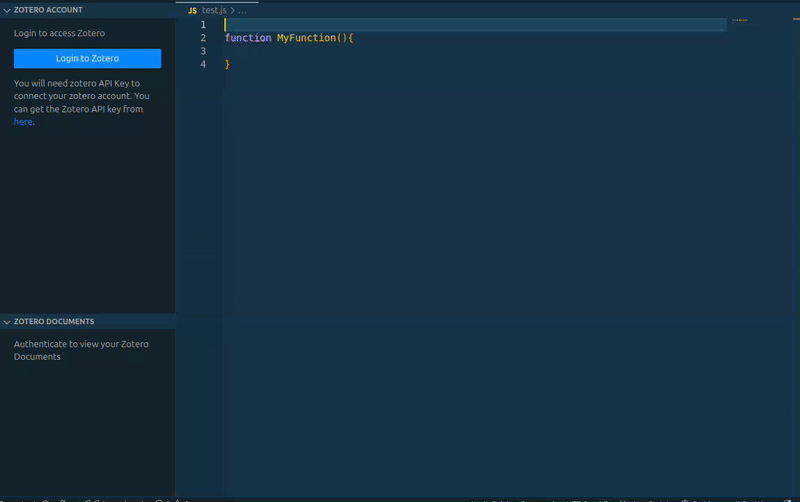

# Sci2Code

VsCode Extension to connect with [Zotero](https://www.zotero.org/).

**Sci2Code** bridges the gap between your research library and your code. This extension allows seamless integration of **Zotero**, your trusted reference manager, directly into **Visual Studio Code**. Easily link academic articles, papers, and other resources from your Zotero library as inline citations in your code using **JSDoc** and **PyDoc** comments.

- 🔗 **Link Zotero items** directly into your code as references  
- ✍️ **Insert citations** into JavaScript and Python documentation comments (JSDoc / PyDoc)  
- 📚 **Browse and search** your Zotero library from within VS Code  
- 🔄 **Sync your code** with your research for better traceability

---

**Ideal for** researchers, students, and developers working on scientific or data-driven projects who want to keep references organized, accessible, and close to their code.

## Installation
You can install the extension from within Visual Studio Code or download it from [Visual Studio Code Marketplace]().

## Get Started
To get started using the extension, open any Javascript(.js), Typescript(.ts), JavascriptXML(.jsx), TypescriptXML(.tsx), python(.py), Julia(.jl), and R(.r) file.

### Features

- This extension allows to connect VsCode with Zotero.
- Cite Reference from Zotero to Source Code.
- This extension works in JavaScript (.js), TypeScript (.ts), JavaScript XML (.jsx), TypeScript XML (.tsx), Python (.py), Julia (.jl), and R (.r) files.
- This extension supports searching documents with Title, DOI, ISBN and ISSN.
- The suggestions for Zotero document trigger when pressing:
  - `/**` for **JavaScript** and **TypeScript** files  
  - `"""` for **Python** files  
  - `"""` for **Julia** files  
  - `#'` for **R** files

- After choosing the document from suggestion the extension generate a unique codeId and create a jsDoc comment or pyDoc for the function with the details about zotero document:

```
/**
 * @ZoteroArticleIDs: ZOTERO_ARTICLE_ID
 * @ZoteroArticleNames: ZOTERO_ARTICLE_NAME
 * @ZoteroitemType: ZOTERO_ARTICLE_TYPE
 * @ZoteroArticleURLs: ZOTERO_ARTICLE_URL
 * @CodeID: CODE_ID
 */
async function calculateDifference(c,b){

}
```

- After creating the jsDoc comment the extension adds a new tag to document in zotero with the information containing codeId and functionName: 
```
{"codeId":CODE_ID,"functionName":"calculateDifference"}
```



## Requirements

- This extension runs on VsCode only.
- This extension requires API Key from Zotero to work. You can get the API key from [here](https://www.zotero.org/settings/keys).
- NodeJs
- Pnpm (Package Manager)

## Running Extension locally

#### Follow the steps below to run the extension locally:

- Install the dependencies

```
pnpm i
```

- Compile project

```
pnpm run compile
```

- To run the extension in watch mode, use the command below:

```
pnpm run compile
```

- Select Run -> Start Debugging from VsCode Navbar

- The Extension will start in a new VsCode Window in Debugging Mode

## For more information

- [Visual Studio Code's Extension API ](https://code.visualstudio.com/api)
- [Extension Guidelines](https://code.visualstudio.com/api/references/extension-guidelines)

## Contact Us
We encourage all feedback. If you encounter a technical issue or have an enhancement request, create an issue here or contact The Self Research Institute at [support@selfresearch.org](mailto:support@selfresearch.org).

## Release Notes

### 1.0.0
Release date: 2025-04-09

* Initial release.
